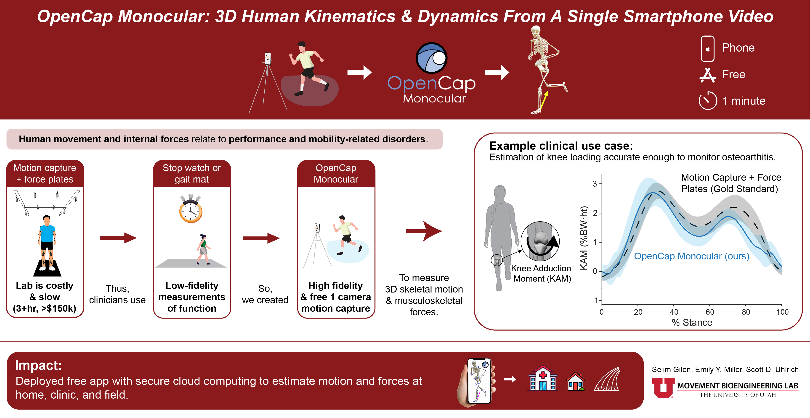

<p align="center">
  
</p>

<p align="center">
<a href="https://utahmobl.github.io/OpenCap-monocular-project-page" target="_blank"></a>
<a href="https://arxiv.org/abs/2603.24733" title="Paper">
  
</a>
<a href="https://www.opencap.ai" title="Get Started"></a>
</p>

# OpenCap Monocular

**3D Human Kinematics and Dynamics From a Single Smartphone Video**

OpenCap-Monocular estimates 3D human movement kinematics and musculoskeletal kinetics from a single smartphone video, combining pose estimation, camera optimization, and biomechanical modeling.

## Features

- Single-camera processing
- 3D pose estimation (WHAM)
- Camera and pose optimization
- OpenSim integration
- Activity classification (walking, sit-to-stand, squats, …)

---

## Installation

### Option A — Docker (recommended for deployment)

Requires NVIDIA driver ≥ 520, `nvidia-container-toolkit`, and Docker with BuildKit.

```bash
git clone https://github.com/utahmobl/opencap-monocular.git --recursive
cd opencap-monocular

# Configure environment
cp .env.example .env
# Edit .env and fill in API_TOKEN, MONO_API_KEY, etc.

# Build images (first time ~10 min)
docker buildx build -f docker/Dockerfile -t opencap-mono:latest .
docker buildx build -f docker/Dockerfile.logs -t opencap-mono-logs:latest .

# Start API + worker
docker compose -f docker/docker-compose.yml up mono-api mono-worker -d
```

See **[docker/README.md](docker/README.md)** for the full guide (all services, rebuilds, logs, troubleshooting).

### Option B — Bare-metal conda

Requires Ubuntu 20.04/22.04, Python 3.9, NVIDIA driver ≥ 520.

```bash
git clone https://github.com/utahmobl/opencap-monocular.git --recursive
cd opencap-monocular
```

See **[installation/INSTALL_SLIM.md](installation/INSTALL_SLIM.md)** for step-by-step instructions.

---

## Pipeline

1. Video preprocessing & rotation correction
2. WHAM 3D pose estimation
3. Camera extrinsics & pose optimization
4. OpenSim IK and export
5. Visualization (`mono.json` for [OpenCap Visualizer](https://visualizer.opencap.ai))

## Outputs

- `mono.json` — OpenCap viewer
- `*.trc`, `*.mot` — OpenSim formats
- `*_scaled.osim` — Scaled model

## Acknowledgments

[WHAM](https://github.com/yohanshin/WHAM) · [ViTPose](https://github.com/ViTAE-Transformer/ViTPose) · [SLAHMR](https://github.com/vye16/slahmr) · [OpenCap](https://opencap.ai) · [OpenSim](https://opensim.stanford.edu) · [VideoLLaMA3](https://github.com/DAMO-NLP-SG/VideoLLaMA3)

## License

See [LICENSE](LICENSE).
